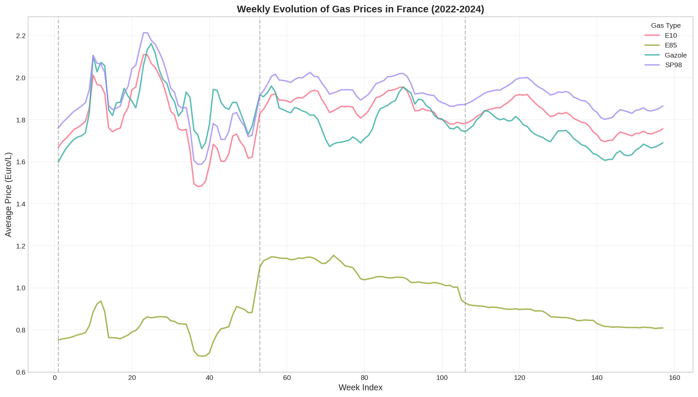
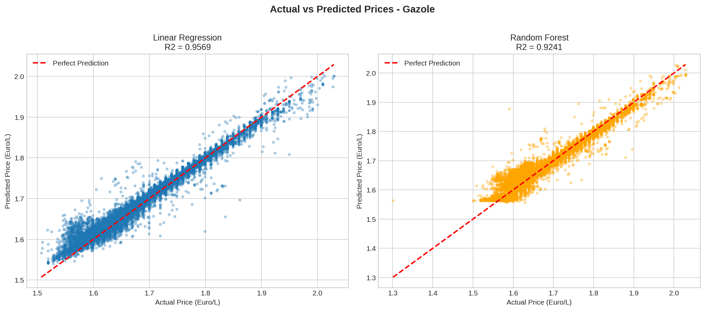
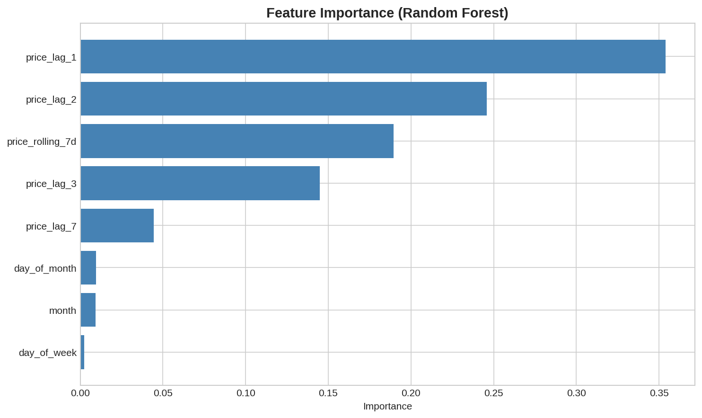

# Gas Consumption in France 

**Big Data Analysis of Gas Prices using Apache Spark**

---

## Project Overview

This project analyzes **3 years of gas price data** (2022-2024) from over 14,000 gas stations across France using Apache Spark. We build a complete data pipeline: from data collection to price forecasting.

### Objectives
- Load and process gas price data with **PySpark**
- Visualize gas price evolution over time
- Build a **machine learning model** to forecast next-day prices
- Create **geographic visualizations** of price indexes by department

---

## Dataset

| File | Description | File's size |
|------|-------------|---------|
| Prix2022S1.csv | Prices Jan-Jun 2022 | ~178MB |
| Prix2022S2.csv | Prices Jul-Dec 2022 | ~156MB |
| Prix2023.csv | Prices 2023 | ~322MB |
| Prix2024.csv | Prices 2024 | ~310MB |
| Stations2024.csv | Station locations | ~2.6K |
| Services2024.csv | Station services | ~980K |

The total price records is `14,214,837`

**Source:** [French Government Open Data](https://www.prix-carburants.gouv.fr/) via [GitHub](https://github.com/rvm-courses/GasPrices)

### Gas Types Analyzed
- **Gazole** (Diesel) - Most common
- **SP98** (Premium Unleaded 98)
- **E10** (Unleaded with 10% ethanol)
- **E85** (85% ethanol - flex gas)

---

## Results

### 1. Weekly Price Evolution (2022-2024)



**Key Observations:**

- **2022 Energy Crisis**: Sharp price spike around week 20-25 (Probably Ukraine war impact)
- **Peak prices**: ~2.20 €/L for SP98, ~2.15 €/L for Gazole
- **E85**: Consistently cheapest (~0.80-1.15 €/L) 
- **2023-2024**: Gradual stabilization around 1.70-1.90 €/L
- **Price hierarchy**: SP98 > E10 > Gazole > E85


---

### 2. Geographic Analysis - Price Index by Department

Interactive maps showing which departments are cheaper (green) or more expensive (red) than the national average.

| Gas Type | Map |
|----------|-----|
| Gazole | [View Map](./figures/france_gas_prices_mapGazole.html) |
| SP98 | [View Map](./figures/france_gas_prices_mapSP98.html) |
| E10 | [View Map](./figures/france_gas_prices_mapE10.html) |
| E85 | [View Map](./figures/france_gas_prices_mapE85.html) |

**Price Index Interpretation:**
- `= 1.0` -> Station price equals national average
- `> 1.0` -> More expensive than average (red)
- `< 1.0` -> Cheaper than average (green)
- In general, Gas is more expensive in Paris and its surroundings 
- E85 is highly expensive in Corse

---

### 3. Price Forecasting Model

We built models to predict next-day gas prices using **lag features** (past prices as inputs).

#### Model Comparison

| Model | R2 | RMSE | MAE |
|-------|-----|------|-----|
| **Linear Regression** | **0.9569** | 0.0163 | 0.0121 |
| Random Forest | 0.9241 |  0.0216  | 0.0152 |

#### Dispersion Plot (Actual vs Predicted)



**Interpretation:**
- Points close to the red diagonal = good predictions
- Linear Regression performs slightly better (R2 = 0.9569)

---

### 4. Feature Importance



**Most Important Features:**
1. **price_lag_1** (35%) - Yesterday's price is the best predictor
2. **price_lag_2** (25%) - Price 2 days ago
3. **price_rolling_7d** (19%) - 7-day moving average 
4. **price_lag_3** (14%) - Price 3 days ago
5. **price_lag_7** (4%) - Same day last week

**Least Important from random forest:** `day_of_week`, `month`, `day_of_month` (< 2% combined)

**Conclusion:** Gas prices are highly autocorrelated - recent prices are the best predictors of future prices. Calendar features have minimal impact.

---

## Technical Stack

| Tool | Purpose |
|------|---------|
| **PySpark** | Big data processing (Billion of records) |
| **Spark SQL** | Data aggregation and queries |
| **Spark ML** | Machine learning pipelines |
| **Matplotlib/Seaborn** | Static visualizations |
| **Folium** | Interactive geographic maps |
| **Pandas** | Data manipulation for plotting |

---

## Project Structure

```
├── data/
│   ├── Prix2022S1.csv
│   ├── Prix2022S2.csv
│   ├── Prix2023.csv
│   ├── Prix2024.csv
│   ├── Stations2024.csv
│   └── Services2024.csv
├──figures/
|   |---gas_prices_evolution.png         # Price evolution chart
|   ├── model_dispersion_plot.png        # Model evaluation
|   ├── feature_importance.png           # Feature importance
|   ├── france_gas_prices_map*.html      # Interactive maps
├── gas_consumption_france.ipynb    # Main notebook
├── config.yaml                      # Configuration file
└── README.md
```
---

## How to Run

### Prerequisites
```bash
pip install numpy pandas pyyaml pyspark matplotlib seaborn geopandas folium
```

`A java version installed`

### Execution
1. Download data files from [GitHub](https://github.com/rvm-courses/GasPrices)
2. Place CSV files in `./data/` directory
3. Run the Jupyter notebook: `gas_consumption_france.ipynb`

---

## Key Formulas

### Price Index
```
Price Index = 100 × (Station Price - National Average) / National Average + 1
```

### Week Index
```
Week Index = floor((Current Date - First Date) / 7) + 1
```

---

## 👤 Author

**[Glorie METSA WOWO](https://www.linkedin.com/in/glorie-wowo-data-science-edtech/)**  
January 2026

---

## 📄 License

This project uses open data from the French government.
